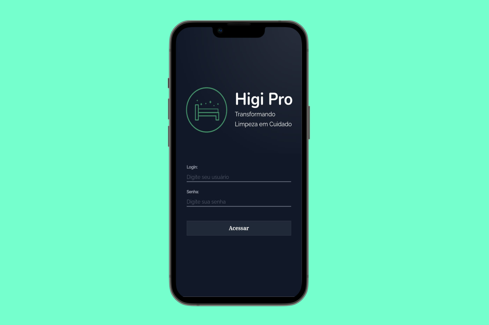

# 🏥 Sistema de Higienização Hospitalar - QR Code Scanner

**Software open source que revoluciona o processo de higienização hospitalar através da leitura simplificada de QR codes nos leitos.**

## 📋 Sobre o Projeto

Este sistema foi desenvolvido para otimizar o tempo de higienização hospitalar, permitindo que profissionais de limpeza identifiquem leitos através de um simples QR code. A solução integra-se diretamente ao sistema hospitalar **Tasy**, proporcionando agilidade e precisão nos processos de higienização.

**Desenvolvido inicialmente para o Hospital M'Boi Mirim**, o projeto se tornou um **caso de sucesso reconhecido na Feira de Exposição de Tecnologia do Hospital Albert Einstein em 2024**.

## 🎯 Principais Funcionalidades

- **Leitura rápida de QR codes** nos leitos hospitalares
- **Integração nativa com sistema Tasy**
- **Interface intuitiva** para profissionais de limpeza
- **Registro automático** de processos de higienização
- **Relatórios em tempo real**
- **Suporte a múltiplos usuários simultâneos**

## 📊 Resultados Comprovados

- ✅ **Mais de 60 usuários simultâneos** por turno no Hospital M'Boi Mirim
- ✅ **Redução significativa no tempo** de identificação de leitos
- ✅ **Reconhecido como um dos maiores cases de sucesso de 2024**
- ✅ **Apresentado na Feira de Tecnologia do Hospital Albert Einstein**

## 🚀 Demonstração

### Screenshots
 


### Demo em Funcionamento
 

## 🛠️ Tecnologias Utilizadas

**Backend:**
- Java Spring Boot
- Maven
- Integração com sistema Tasy

**Frontend:**
- React.js
- HTML5/CSS3/JavaScript/Tailwind
- Interface responsiva

## ⚙️ Instalação e Configuração

### Pré-requisitos
- Java 11 ou superior
- Node.js 14 ou superior
- Sistema Tasy configurado
- Maven

### Backend
```bash
cd backend
mvn clean install
mvn spring-boot:run
```

### Frontend
```bash
cd frontend
npm install
npm start
```


## 🏥 Compatibilidade

Este software é compatível com **qualquer hospital que utilize o sistema Tasy**, podendo ser adaptado conforme as necessidades específicas de cada instituição.

## 👨‍💻 Desenvolvedor

**Yuri** - Desenvolvedor Principal

[](https://www.linkedin.com/in/yuri-santos-285155208/)

## 🤝 Contribuições

Contribuições são muito bem-vindas! Este é um projeto open source criado para beneficiar toda a comunidade hospitalar brasileira.

1. Faça um fork do projeto
2. Crie uma branch para sua feature (`git checkout -b feature/AmazingFeature`)
3. Commit suas mudanças (`git commit -m 'Add some AmazingFeature'`)
4. Push para a branch (`git push origin feature/AmazingFeature`)
5. Abra um Pull Request


## 📞 Suporte

Para dúvidas, sugestões ou implementação em sua instituição:

- **LinkedIn**: [Perfil do Yuri](https://www.linkedin.com/in/yuri-santos-285155208/)
- **Issues**: Utilize a aba Issues do GitHub para reportar bugs ou solicitar features

---

**Desenvolvido com ❤️ para a comunidade hospitalar brasileira**

*"Tecnologia a serviço da saúde e bem-estar dos pacientes"*